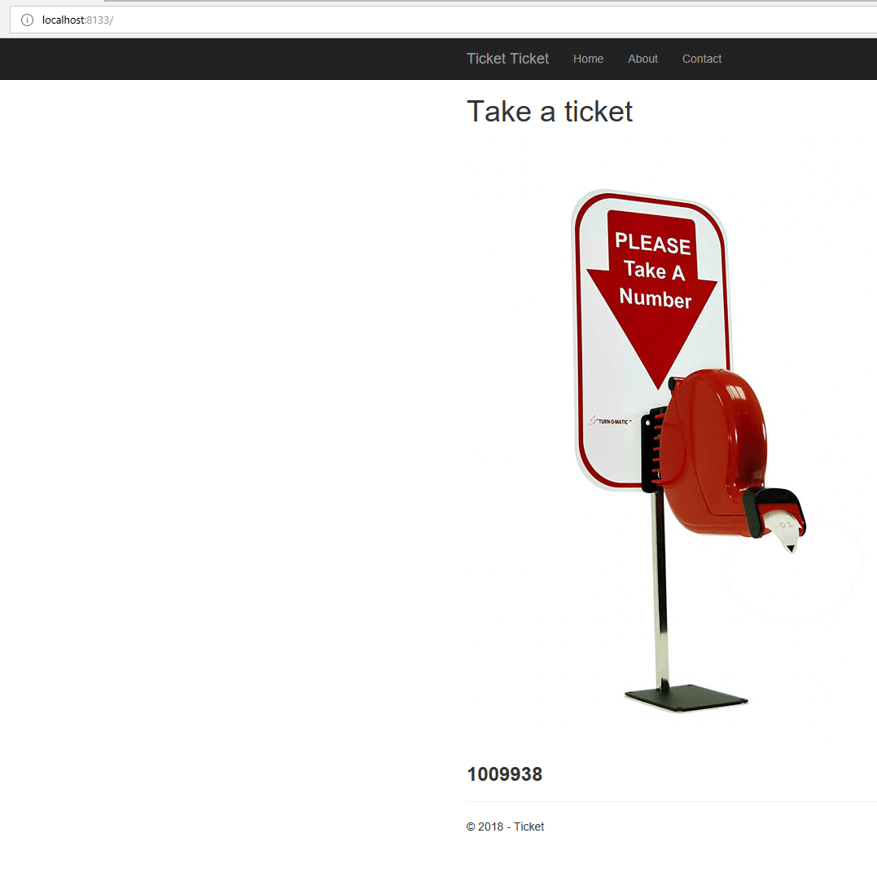
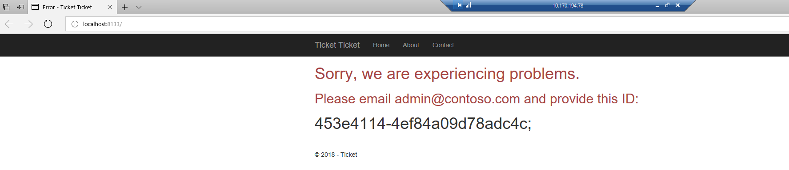
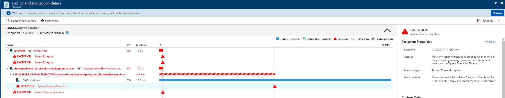
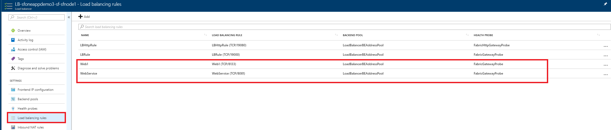
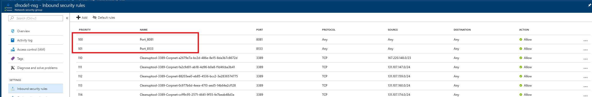

# ticketapp-SF-AI

## Overview
This this a sample Service Fabric application that is configured to use Application Insights for monitoring and diagnostics. This app is intended to generate errors randomly to show how exceptions can be correlated to requests in Application Insights

## How to configure the app to use App Insights

The sample in /src/ already contains the code below to enable Application Insights. These steps are just to explain the work needed.

### Prerequisite
Make sure you have an Application Insights resource provisioned in your Azure Subscription. Follow instructions at [Create an Application Insights resource](https://docs.microsoft.com/en-us/azure/application-insights/app-insights-create-new-resource)

### Configure App Insights IKEY
Follow instructions at [
Using Service Fabric with Application Insights](https://github.com/Azure-Samples/service-fabric-dotnet-getting-started/blob/dev/appinsights/ApplicationInsights.md)

### Install Application Insights NuGet Packages
* Microsoft.ApplicationInsights.ServiceFabric.Native
* Microsoft.ApplicationInsights.AspNetCore
* Microsoft.ApplicationInsights.EventSourceListener
* Microsoft.ApplicationInsights.DependencyCollector
* Microsoft.aspnet.telemetrycorrelation
* All dependencies for above

### Add Code to initialize telemetry client
A few lines of code is required to initialize the telemetry client for sending data to the right Application Insights

#### Web1 ASP.NET core stateless Service
In Web1.cs

Add the following using statements

``` csharp
using Microsoft.ApplicationInsights.ServiceFabric;
using Microsoft.ApplicationInsights.Extensibility;
using Microsoft.ApplicationInsights.EventSourceListener;
```

Add the following code in WebHostBuilder ConfigureServices:

``` csharp
.AddSingleton<ITelemetryInitializer>((serviceProvider) => FabricTelemetryInitializerExtension.CreateFabricTelemetryInitializer(serviceContext))
.AddSingleton<ITelemetryModule>((serviceProvider) => CreateEventSourceTelemetryModule())
```
Add the following method in the Web1 class

``` csharp
private EventSourceTelemetryModule CreateEventSourceTelemetryModule()
        {
            var module = new EventSourceTelemetryModule();
            module.Sources.Add(new EventSourceListeningRequest() { Name = "Microsoft-ServiceFabric-Services", Level = EventLevel.Verbose });
            module.Sources.Add(new EventSourceListeningRequest() { Name = "MyCompany-GettingStartedApplication-WebService", Level = EventLevel.Verbose });
            return module;
        }
```

In ConfigSettings.cs

Add the following using statements
```csharp
using System.Fabric;
using System.Fabric.Description;
```

Create a private method UpdateConfigSettings

``` csharp
private void UpdateConfigSettings(ConfigurationSettings settings)
{

    var appInsights = settings.Sections["ApplicationInsights"];
    var telemetryConfig = Microsoft.ApplicationInsights.Extensibility.TelemetryConfiguration.Active;
    telemetryConfig.InstrumentationKey = appInsights.Parameters["InstrumentationKey"].Value;
}

```

Call the method in ConfigSettings constructor

``` csharp
public ConfigSettings(StatelessServiceContext context)
      {
          context.CodePackageActivationContext.ConfigurationPackageModifiedEvent += this.CodePackageActivationContext_ConfigurationPackageModifiedEvent;
          this.UpdateConfigSettings(context.CodePackageActivationContext.GetConfigurationPackageObject("Config").Settings);
      }
```

#### StatelessBackendService

In StatelessBackendService.cs
Add the following using statements

```csharp
using Microsoft.ApplicationInsights.Extensibility;
   using Microsoft.ApplicationInsights;
   using Microsoft.ApplicationInsights.ServiceFabric;
   using Microsoft.ServiceFabric.Services.Remoting.V1.FabricTransport.Runtime;
   using Microsoft.ApplicationInsights.ServiceFabric.Remoting.Activities;
```

Add the following code to the constructor of StatelessBackendService

```csharp
public StatelessBackendService(StatelessServiceContext context)
            : base(context)
        {
            var telemetryConfig = TelemetryConfiguration.Active;

            // Replace the fabric telemetry initializer, if there is one, with one that has the rich context
            for (int i = 0; i < telemetryConfig.TelemetryInitializers.Count; i++)
            {
                if (telemetryConfig.TelemetryInitializers[i] is FabricTelemetryInitializer)
                {
                    telemetryConfig.TelemetryInitializers[i] = FabricTelemetryInitializerExtension.CreateFabricTelemetryInitializer(context);
                    break;
                }
            }

            var config = context.CodePackageActivationContext.GetConfigurationPackageObject("Config");
            var appInsights = config.Settings.Sections["ApplicationInsights"];
            telemetryConfig.InstrumentationKey = appInsights.Parameters["InstrumentationKey"].Value;

            this.telemetryClient = new TelemetryClient(telemetryConfig);
        }
```


## How to run the app

### Setup development environment

1. Clone this repository

2. Make sure you have [Visual Studio IDE](https://www.visualstudio.com/) with Azure development workload installed

### Debug the app locally

1. Make sure you have created an [Application Insights resource](https://docs.microsoft.com/en-us/azure/application-insights/app-insights-create-new-resource) in your Azure subscription

2. Open the project in Visual Studio using Administrator mode.

3. Go to GettingStartedApplication / ApplicationPackageRoot / ApplicationManifest.xml, replace all [ApplicationInsights_Key] with your real Application Insights key.

4. Make sure *GettingStartedApplication* is set to be the startup projects

5. Start debugging. If it's first time you debug a Service Fabric application, it might take a bit longer as the local cluster needs to be initialized.

6. You will see a web page opening similar to below:



Refresh the browser a few times until you see error with correlation ID:



7. Go to Application Insights, paste the error correlation ID in the Search pane. You will see E2E traces similar to the following that explains what went wrong in the app:




### Setup Azure hosting environment

This section describes how to setup a secure Service Fabric cluster to host your application.

1. Create a [Service Fabric Cluster](https://azure.microsoft.com/en-us/services/service-fabric/) following this instruction: [Create a Service Fabric cluster by using Azure Resource Manager](https://docs.microsoft.com/en-us/azure/service-fabric/service-fabric-cluster-creation-via-arm#create-key-vault). Choose at least D1_V2 sku for VM size

2. Once cluster is created, go to the Load Balancer resource, open Load balancing rules pane and add a rule to route traffic to your app. In this case, the app uses port 8081 and 8133, which is specified in the ServiceManifest.xml files for Web1 and WebService projects.



3. If you enabled Network Security Group when creating the cluster (which is recommended), to the you NSG resource and add port 8081 and 8133 to configure how public traffic can access your app.




### Deploy to Azure

1. Go to Web1/Controllers/HomeController.cs, change this line of code in Index method to point to your cluster

Before:

```csharp
HttpResponseMessage response = await client.GetAsync("http://localhost:8081/api/StatelessBackendService/");
```

After:

```csharp
HttpResponseMessage response = await client.GetAsync("http://your-sf-cluster-domain-name.centralus.cloudapp.azure.com:8081/api/StatelessBackendService/");
```

2. install the certificate you created in previous section to your local development machine. Having the certificate in Personal store under Current User is sufficient.

3. Right click on the GettingStartedApplication, select Publish...

4. Enter the Connection Endpoint to point to the cluster you created earlier. After a little while, you should see a green check mark indicating your machine can connect to the cluster endpoint using the certificate you installed earlier.

5. Click Publish

6. Navigate to your application hosted on the cluster, refresh the page, generate some Exceptions and navigate to your Application Insights resource to view E2E traces
